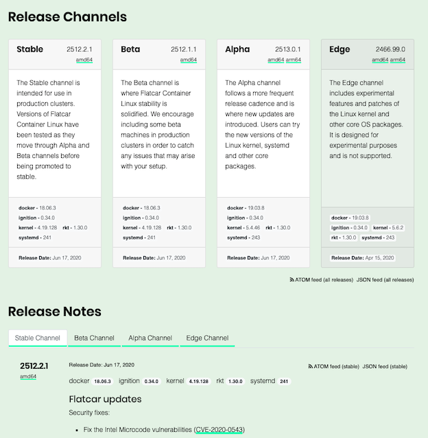

## How to keep your k8s workers healthy, patched and secure without any impact on hosted applications

---

# #agenda

* glossary
* worker lifecycle
* be smart about your worker OS
* tools to make your life easier
* Q&A

---

# #whoAmI

Michal Schott

* WebOps Engineer
* Street Manager
* k8s or die!

https://schottlabs.eu/resume/

---

## #glossary

----

* **k8s** - kubernetes

* **k8s masterplane** - set of VMs to control state of k8s cluster

* **k8s workers** - these are running your containers, regular VM with OS attached to k8s masterplane

* **kubectl** - ssh replacement

Note:
* k8s workers - regular VM with OS attached to k8s masterplane

----

----

* **pod** - collection of containers

* **endpoint** - IP address of single pod

* **service** - load balanced collection of endpoints

* **PDB** - pod disruption budged

Note:
* service - (round robin) dedicated single IP to access your containers
* PDB - how many pods needs to stay in healthy state during maintenance

----

* **node is healthy** - no kernel deadlocks, kubelet is ready...

* **patched** - OS is up-to-date with all patches available

* **secure** - attack vector is as small as possible

* **impact on hosted application** - end user do not notice downtime

----

* **node unscheduleable** - k8s scheduler can **NOT** assign pods to node // kubectl cordon

* **node scheduleable** - k8s scheduler can assign pods to node // kubectl uncordon

* **eviction** - pod termination event, usually happens when you want to relocate workload to different worker // kubectl drain

---

## #workerLifecycle

----

* Worker VMs runs kubelet

* kubelet contacts k8s-apiserver, presents identity and request for client certificate

* k8s-apiserver validates identity and returns certificate to the client

* kubelet starts any further communication using client certificate // mTLS

* hearthbeat, node lease objects in kube-node-lease

* kubectl get/describe node

Note:

kubectl -n kube-node-lease get lease

Each Node has an associated Lease object in the kube-node-lease namespace. An abstraction used by Kubernetes to support multiple virtual clusters on the same physical cluster.

Lease is a lightweight resource, which improves the performance of the node heartbeats as the cluster scales.

----

## Lets shutdown a node in a dirty way! // demo

Note:
terminate aws instance

show node is still there in k8s store

it will disappear after a while

----

* containers had no time for graceful shutdown
* possible service disruption - how to prevent this?

Note:
Any stateful workload could be interrupted, which might lead to data inconsistency

You cant fully prevent such situations but you can do it way better 

----

## Lets shutdown a node in a clean way! // demo

Note:
kubectl cordon

kubectl drain

reboot

kubectl uncordon

----

* containers were gracefully terminated
* k8s-scheduler was able to schedule new replicas on different nodes
* 100% service uptime

---

## #workerOS

----

* k8 supports both Linux and Windows
* ubuntu? rhel?
* what else have we got?<!-- .element: class="fragment" -->

----

## meet Container Optimized Linux

----

### Cloud Providers Solutions

* AWS - Amazon Linux
* GCP - Container-Optimized OS
* Azure - ?

----

### Universal / made by geeks

* RHEL / CentOS / Fedora Atomic Host
* Ubuntu have most recent and updated kernel (first distro with 5.X)<!-- .element: class="fragment" -->
* Core CoreOS<!-- .element: class="fragment" -->
* RHEL/Fedora CoreOS<!-- .element: class="fragment" -->
* Kinvolks FlatCar Linux<!-- .element: class="fragment" -->

----

### CORE

They've build:

rkt // etcd // quay 

clair // dex // flannel

ignition // tectonic

AND A LOT MORE

Recently they were acquired by Red Hat (and by IBM)

----

Kinvolks Flatcar Linux continues CoreOS legacy

* reduce attack surface
* immutable file system
* driven by principle of least privilege
* automatic updates
* secure container runtime

----

---

## #makeYourLifeEasier

----

* pick container-optimised linux flavour
* kured<!-- .element: class="fragment" -->
* coreos/container-linux-update-operator<!-- .element: class="fragment" -->
* kinvolk/flatcar-linux-update-operator<!-- .element: class="fragment" -->

----

* node-problem-detector
* node-local-dns-cache<!-- .element: class="fragment" -->
* k8s-spot-termination-handler<!-- .element: class="fragment" -->
* cluster-autoscaler!<!-- .element: class="fragment" -->
* overprovision nodes with cluster-proportional-autoscaler!<!-- .element: class="fragment" -->

---

# Q&A

